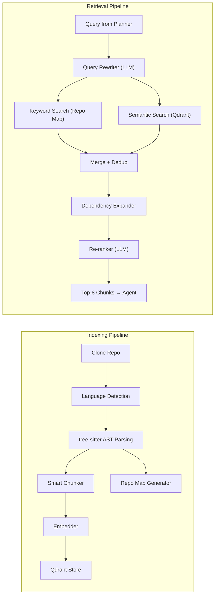

# Deep Dive: Codebase RAG Engine

> This is the single most important component. Bad retrieval → bad code → failed tests → wasted retries.

---

## Component Map



---

## 1. Language Detection (`language_detect.py`)

### Purpose
Scan the repo and identify which languages are present, so we load the correct tree-sitter grammars.

### Logic
```python
LANGUAGE_MAP = {
    ".py":    "python",
    ".js":    "javascript",
    ".ts":    "typescript",
    ".tsx":   "typescript",
    ".go":    "go",
    ".java":  "java",
    ".rs":    "rust",
}

IGNORE_DIRS = {
    ".git", "node_modules", "__pycache__", ".venv", "venv",
    "dist", "build", ".egg-info", ".tox", ".mypy_cache"
}

IGNORE_FILES = {
    "package-lock.json", "yarn.lock", "poetry.lock",
    "*.min.js", "*.min.css", "*.map"
}
```

### Output
```python
@dataclass
class RepoLanguageProfile:
    primary_language: str            # most files
    languages: Dict[str, int]        # {"python": 42, "javascript": 12}
    total_files: int
    total_lines: int
    has_tests: bool                  # detected test directories
    test_framework: Optional[str]    # "pytest" | "jest" | "go test" | etc.
    package_manager: Optional[str]   # "pip" | "npm" | "cargo" | etc.
```

### How test framework is detected
| Signal | Framework |
|--------|-----------|
| `pyproject.toml` or `setup.py` with pytest | `pytest` |
| `package.json` with `"jest"` or `"mocha"` in devDeps | `jest` or `mocha` |
| `go.mod` exists | `go test` |
| `Cargo.toml` exists | `cargo test` |
| `pom.xml` or `build.gradle` | `maven` or `gradle` |

---

## 2. Tree-Sitter AST Parsing (`chunker.py`)

### Purpose
Parse source files into AST nodes and extract meaningful code units (functions, classes, methods) — NOT raw line splits.

### Why tree-sitter over regex?
| Approach | Problem |
|----------|---------|
| Regex | Breaks on nested functions, decorators, multiline strings |
| Line splits (every 50 lines) | Cuts functions in half, loses context |
| **tree-sitter AST** | **Understands code structure perfectly for any language** |

### Chunking Strategy

#### Step 1: Parse file into AST
```python
import tree_sitter_python as tspython
from tree_sitter import Language, Parser

PY_LANGUAGE = Language(tspython.language())
parser = Parser(PY_LANGUAGE)
tree = parser.parse(file_bytes)
```

#### Step 2: Walk AST and extract nodes

**Python node types to extract:**
| Node Type | What It Captures |
|-----------|-----------------|
| `function_definition` | Standalone functions |
| `class_definition` | Entire class (including methods) |
| `decorated_definition` | `@decorator` + function/class below it |
| `import_statement` | `import x` |
| `import_from_statement` | `from x import y` |

**JavaScript/TypeScript node types:**
| Node Type | What It Captures |
|-----------|-----------------|
| `function_declaration` | `function foo() {}` |
| `arrow_function` | `const foo = () => {}` |
| `class_declaration` | `class Foo {}` |
| `export_statement` | `export default/named` |
| `import_statement` | `import ... from ...` |

**Go node types:**
| Node Type | What It Captures |
|-----------|-----------------|
| `function_declaration` | `func foo() {}` |
| `method_declaration` | `func (r *Receiver) foo() {}` |
| `type_declaration` | `type Foo struct {}` |

#### Step 3: Build CodeChunk objects

```python
@dataclass
class CodeChunk:
    chunk_id: str              # hash of file_path + start_line
    file_path: str             # relative to repo root
    language: str              # "python", "javascript", etc.
    chunk_type: str            # "function" | "class" | "method" | "module_imports"
    name: str                  # function/class name
    signature: str             # "def calculate_discount(price: float, discount: float) -> float:"
    body: str                  # full source code of the chunk
    docstring: Optional[str]   # extracted docstring/JSDoc
    start_line: int
    end_line: int
    parent_class: Optional[str]  # if this is a method, the class it belongs to
    decorators: List[str]        # ["@staticmethod", "@app.route('/api')"]
    imports_used: List[str]      # imports referenced in this chunk's body

    # Populated during embedding
    embedding: Optional[List[float]] = None
```

#### Step 4: Context enrichment (CRITICAL for quality)

Before embedding, **prepend context** to each chunk's text representation:

```python
def build_embedding_text(chunk: CodeChunk, file_imports: List[str]) -> str:
    """Build the text that gets embedded — includes surrounding context."""
    parts = []

    # 1. File path as context
    parts.append(f"# File: {chunk.file_path}")

    # 2. Relevant imports from the file (so the LLM knows what's available)
    if file_imports:
        parts.append("# Imports:\n" + "\n".join(file_imports[:10]))

    # 3. Parent class context (if method)
    if chunk.parent_class:
        parts.append(f"# Part of class: {chunk.parent_class}")

    # 4. The actual code
    parts.append(chunk.body)

    return "\n\n".join(parts)
```

#### Handling large classes (> 512 tokens)
If a class body exceeds 512 tokens:
1. Create one **class-level chunk** with just: class signature + docstring + method signatures (no bodies)
2. Create **per-method chunks** for each method, with `parent_class` set

This way:
- Searching for "how does UserService work?" → finds the class overview chunk
- Searching for "how does authentication work?" → finds the specific `authenticate()` method chunk

---

## 3. Repo Map Generator (`repo_map.py`)

### Purpose
Create a structured overview of the entire repository that fits in an LLM context window. Think of it as a "table of contents" for the codebase.

### Output format
```json
{
  "repo": "swe-agent-playground",
  "total_files": 14,
  "languages": {"python": 10, "javascript": 3, "json": 1},
  "structure": {
    "backend/": {
      "main.py": {
        "type": "module",
        "imports": ["fastapi", "uvicorn"],
        "functions": ["create_app()"],
        "classes": []
      },
      "models.py": {
        "type": "module",
        "imports": ["sqlmodel", "typing"],
        "functions": [],
        "classes": [
          {
            "name": "User",
            "methods": ["__init__", "to_dict"],
            "bases": ["SQLModel"]
          },
          {
            "name": "Product",
            "methods": ["__init__", "to_dict"],
            "bases": ["SQLModel"]
          }
        ]
      },
      "routes/users.py": {
        "type": "module",
        "imports": ["fastapi", "models"],
        "functions": ["get_user(id)", "create_user(data)", "list_users()"],
        "classes": []
      }
    }
  },
  "dependency_graph": {
    "backend/routes/users.py": ["backend/models.py", "backend/database.py"],
    "backend/routes/products.py": ["backend/models.py", "backend/database.py"],
    "backend/main.py": ["backend/routes/users.py", "backend/routes/products.py"]
  }
}
```

### Why this matters
- The **Planner** gets this as context → knows exactly which files exist and what they contain
- The **Code Writer** gets this → knows where to add new code and what patterns the repo uses
- It's **small** (fits in ~2K tokens even for 100+ file repos) because it only has signatures, not bodies

---

## 4. Embedder (`embedder.py`)

### Embedding Model Selection
| Provider | Model | Dimensions | Cost | Speed |
|----------|-------|-----------|------|-------|
| OpenAI | `text-embedding-3-small` | 1536 | $0.02/1M tokens | Fast |
| Google | `models/text-embedding-004` | 768 | Free tier available | Medium |

**Strategy**: Use OpenAI by default. Fall back to Google if OpenAI key not set.

### Batching Strategy
```python
BATCH_SIZE = 100  # embed 100 chunks at once (API limit)
MAX_TOKENS_PER_CHUNK = 512  # truncate if longer

async def embed_chunks(chunks: List[CodeChunk]) -> List[CodeChunk]:
    texts = [build_embedding_text(c) for c in chunks]

    # Process in batches of 100
    for i in range(0, len(texts), BATCH_SIZE):
        batch = texts[i:i+BATCH_SIZE]
        embeddings = await litellm.aembedding(
            model=settings.EMBEDDING_MODEL,
            input=batch
        )
        for j, emb in enumerate(embeddings.data):
            chunks[i+j].embedding = emb["embedding"]

    return chunks
```

### Qdrant Collection Setup
```python
collection_name = f"repo_{repo_name}_{commit_hash[:8]}"

# Create collection with proper config
qdrant.create_collection(
    collection_name=collection_name,
    vectors_config=VectorParams(
        size=1536,        # matches embedding dimensions
        distance=Distance.COSINE
    )
)

# Store each chunk as a point
points = [
    PointStruct(
        id=hash(chunk.chunk_id),
        vector=chunk.embedding,
        payload={
            "file_path": chunk.file_path,
            "language": chunk.language,
            "chunk_type": chunk.chunk_type,
            "name": chunk.name,
            "signature": chunk.signature,
            "body": chunk.body,
            "start_line": chunk.start_line,
            "end_line": chunk.end_line,
            "parent_class": chunk.parent_class,
        }
    )
    for chunk in chunks
]
qdrant.upsert(collection_name=collection_name, points=points)
```

---

## 5. Retriever (`retriever.py`)

### Full Retrieval Pipeline

```
Planner sub-task: "Fix the get_user function to return 404 on missing user"
                                      │
                    ┌─────────────────┴─────────────────┐
                    ▼                                   ▼
           Step 1: Keyword Search              Step 2: Semantic Search
           (exact name matching)               (meaning-based matching)
                    │                                   │
            Search repo_map for               Embed query → search Qdrant
            "get_user" in function             for "user not found 404
            names and file names               error handling"
                    │                                   │
            Results:                            Results:
            - routes/users.py:get_user()        - routes/users.py:get_user()
            - tests/test_users.py               - models.py:User class
                    │                           - routes/products.py:get_product()
                    └─────────────┬─────────────┘
                                  ▼
                    Step 3: Merge + Deduplicate
                    (union of both result sets, remove dupes by file+line)
                                  │
                                  ▼
                    Step 4: Dependency Expansion
                    (if routes/users.py found → also include models.py
                     and database.py because users.py imports them)
                                  │
                                  ▼
                    Step 5: Re-rank by Relevance
                    (LLM scores each chunk 1-10 for relevance to the query)
                                  │
                                  ▼
                    Step 6: Return Top-8 chunks
                    (sorted by relevance score, each with full metadata)
```

### Step 1: Keyword Search (on Repo Map)

```python
def keyword_search(query: str, repo_map: dict) -> List[str]:
    """Search repo map for exact function/class/file name matches."""
    results = []
    # Extract potential identifiers from query
    # e.g., "Fix get_user function" → ["get_user"]
    identifiers = extract_identifiers(query)  # regex: \b[a-zA-Z_][a-zA-Z0-9_]*\b

    for file_path, file_info in repo_map["structure"].items():
        # Match against function names
        for func in file_info.get("functions", []):
            if any(ident in func for ident in identifiers):
                results.append(file_path)
        # Match against class names
        for cls in file_info.get("classes", []):
            if any(ident in cls["name"] for ident in identifiers):
                results.append(file_path)
        # Match against file name itself
        if any(ident in file_path for ident in identifiers):
            results.append(file_path)

    return list(set(results))
```

### Step 2: Semantic Search (on Qdrant)

```python
def semantic_search(query: str, collection: str, top_k: int = 10) -> List[CodeChunk]:
    """Embed query and search Qdrant for similar code chunks."""
    query_embedding = litellm.embedding(
        model=settings.EMBEDDING_MODEL,
        input=[query]
    ).data[0]["embedding"]

    results = qdrant.search(
        collection_name=collection,
        query_vector=query_embedding,
        limit=top_k,
        score_threshold=0.3  # filter out very low matches
    )

    return [
        CodeChunk(
            file_path=r.payload["file_path"],
            body=r.payload["body"],
            name=r.payload["name"],
            # ... rest of fields from payload
            relevance_score=r.score
        )
        for r in results
    ]
```

### Step 4: Dependency Expansion

```python
def expand_dependencies(
    found_files: List[str],
    dependency_graph: Dict[str, List[str]],
    max_depth: int = 1
) -> List[str]:
    """If file A is relevant, also include files that A imports."""
    expanded = set(found_files)

    for depth in range(max_depth):
        new_files = set()
        for f in list(expanded):
            deps = dependency_graph.get(f, [])
            new_files.update(deps)
        expanded.update(new_files)

    return list(expanded)
```

**Why `max_depth=1`**: Going deeper pulls in too many irrelevant files. One level catches direct imports (models, utils) without pulling in the entire repo.

### Step 5: Re-ranking (LLM-based)

```python
RERANK_PROMPT = """
Given this task: "{query}"

Score each code chunk below from 1-10 for how relevant it is to completing the task.
Return JSON: [{{"chunk_id": "...", "score": N, "reason": "..."}}]

Chunks:
{chunks_text}
"""

async def rerank_chunks(query: str, chunks: List[CodeChunk]) -> List[CodeChunk]:
    """Use LLM to score and sort chunks by relevance."""
    chunks_text = "\n---\n".join(
        f"[{c.chunk_id}] {c.file_path}:{c.name}\n{c.body[:300]}"
        for c in chunks
    )

    response = await litellm.acompletion(
        model=settings.RAG_QUERY_MODEL,  # cheap fast model (Llama 8B)
        messages=[{"role": "user", "content": RERANK_PROMPT.format(
            query=query, chunks_text=chunks_text
        )}],
        response_format={"type": "json_object"}
    )

    scores = json.loads(response.choices[0].message.content)
    score_map = {s["chunk_id"]: s["score"] for s in scores}

    for chunk in chunks:
        chunk.relevance_score = score_map.get(chunk.chunk_id, 0)

    return sorted(chunks, key=lambda c: c.relevance_score, reverse=True)[:8]
```

### Why top-8 specifically?
| Count | Problem |
|-------|---------|
| Top-3 | Too few — misses important context files |
| Top-8 | Sweet spot — ~4K tokens, fits easily in any model's context |
| Top-15 | Too many — dilutes attention, wastes tokens, costs more |

---

## 6. Full Indexing Orchestrator (`indexer.py`)

### Complete flow when a new repo is submitted

```python
async def index_repository(repo_path: str, repo_name: str) -> IndexResult:
    """Full indexing pipeline: detect → parse → chunk → embed → store."""

    # Step 1: Detect languages and test framework
    profile = detect_languages(repo_path)
    log(f"Detected: {profile.languages}, tests: {profile.test_framework}")

    # Step 2: Generate repo map (structural index)
    repo_map = generate_repo_map(repo_path, profile)
    log(f"Repo map: {profile.total_files} files, {len(repo_map['dependency_graph'])} deps")

    # Step 3: Parse + chunk all source files
    all_chunks: List[CodeChunk] = []
    for file_path in get_source_files(repo_path, profile):
        language = get_language(file_path)
        chunks = parse_and_chunk(file_path, language)
        all_chunks.extend(chunks)
    log(f"Created {len(all_chunks)} code chunks")

    # Step 4: Embed all chunks
    all_chunks = await embed_chunks(all_chunks)
    log(f"Embedded {len(all_chunks)} chunks")

    # Step 5: Store in Qdrant
    collection = f"repo_{repo_name}_{get_commit_hash(repo_path)[:8]}"
    store_in_qdrant(collection, all_chunks)
    log(f"Stored in Qdrant collection: {collection}")

    return IndexResult(
        collection_name=collection,
        repo_map=repo_map,
        profile=profile,
        total_chunks=len(all_chunks)
    )
```

### Re-indexing strategy
- **First run**: Full index (all files)
- **Subsequent runs**: Check git diff → only re-index changed files (saves time + cost)
- **Collection naming**: includes commit hash → different commits = different collections (no stale data)
