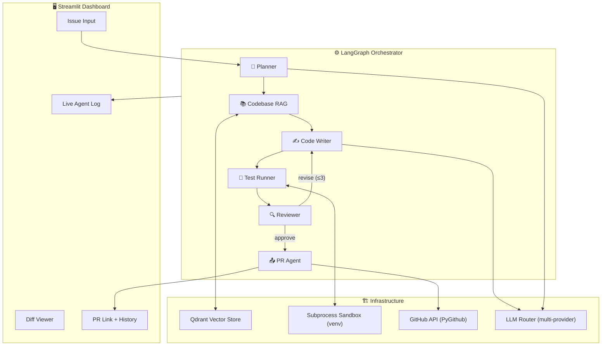
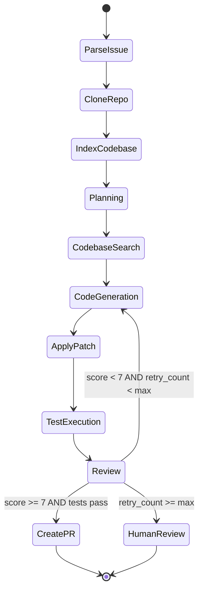

# Autonomous SWE Agent — Architecture & Component Design

> Build your own Devin: GitHub issue in → merged PR out.
> Multi-LLM · Subprocess Sandbox · Multi-language · Real-time UI

---

## Architecture Overview



---

## Tech Stack Decisions

| Layer | Choice | Reason |
|-------|--------|--------|
| **Orchestration** | LangGraph 0.4+ | Stateful graph with cycles (retry loop), checkpointing, human-in-loop |
| **LLM Router** | LiteLLM | Single interface for OpenAI / Gemini / NVIDIA NIM / Anthropic |
| **LLM Models** | GPT-4o, Gemini 1.5 Pro, NVIDIA Llama-3.1-Nemotron | Swappable per task type |
| **Embeddings** | `text-embedding-3-small` (OpenAI) | Best cost/quality; fallback to `models/text-embedding-004` (Google) |
| **Vector Store** | Qdrant (local mode) | You already know it; no extra server needed in local mode |
| **Code Parsing** | `tree-sitter` | AST-aware chunking for Python, JS/TS, Go, Java, Rust |
| **Sandbox** | `subprocess` + isolated `venv` | No Docker needed; safe with timeouts + resource caps |
| **GitHub** | PyGithub + GitPython | Full API: clone, branch, commit, PR |
| **UI** | Streamlit + `streamlit-extras` | Real-time log streaming, diff viewer, run history |
| **Persistence** | SQLite (via SQLModel) | Store run history, agent decisions, costs |
| **Observability** | Arize Phoenix (you have experience!) | Full LLM tracing per run |

---

## Coding Standards — "Human-Written" Rules

> Every line of this project must look like a senior engineer wrote it on a Saturday, not like ChatGPT generated it.

### Comments Style

**❌ AI-generated (avoid this):**
```python
def get_user(user_id: int) -> User:
    """
    This function retrieves a user from the database by their ID.
    
    Args:
        user_id: The ID of the user to retrieve.
    
    Returns:
        User: The user object if found.
    
    Raises:
        HTTPException: If the user is not found.
    """
    user = db.query(User).filter(User.id == user_id).first()
    if user is None:
        raise HTTPException(status_code=404, detail="User not found")
    return user
```

**✅ Human-written (do this):**
```python
def get_user(user_id: int) -> User:
    """Fetch user by ID, 404 if missing."""
    user = db.query(User).filter(User.id == user_id).first()
    if not user:
        raise HTTPException(404, detail="User not found")
    return user
```

### Rules to Follow

| Rule | Example |
|------|---------|
| **Short docstrings** — one line unless truly complex | `"""Apply patches and run tests."""` |
| **Comments explain WHY, not WHAT** | `# shallow clone — full history wastes 2min on large repos` |
| **Use inline `#` notes casually** | `timeout=120  # generous, but some test suites are slow` |
| **Skip obvious comments entirely** | Don't comment `# increment counter` above `count += 1` |
| **Use `TODO` and `HACK` honestly** | `# TODO: add Windows support for resource limits` |
| **Variable names are self-documenting** | `failed_tests` not `list_of_tests_that_failed` |
| **Contractions in comments are fine** | `# don't re-index if nothing changed` |
| **Swear-free frustration is fine** | `# this API is cursed — returns 200 on errors` |
| **No "Args/Returns/Raises" blocks** unless it's a public library API | Just use type hints instead |

### Code Patterns

```python
# ✅ Good — reads like a human wrote it
class CostTracker:
    """Tracks LLM spend per run. Kills the agent if budget is exceeded."""

    def __init__(self, budget: float):
        self.budget = budget
        self._entries = []  # append-only

    def record(self, agent: str, model: str, cost: float):
        self._entries.append({"agent": agent, "model": model, "cost": cost})

    @property
    def total(self) -> float:
        return sum(e["cost"] for e in self._entries)

    def over_budget(self) -> bool:
        # check this before every LLM call
        return self.total >= self.budget


# ❌ Bad — screams "AI generated this"
class CostTracker:
    """
    A class to track the costs associated with LLM API calls.
    
    This class provides functionality to record costs for different
    agents and models, calculate total costs, and check if the
    total cost has exceeded a predefined budget.
    
    Attributes:
        budget (float): The maximum allowed budget in USD.
        _entries (list): A list of cost entry dictionaries.
    """
    ...
```

### File-Level Comments

```python
# graph/workflow.py
# Wires all agent nodes into a LangGraph state machine.
# The retry loop (review → rewrite) is the interesting part — see route_after_review().

from langgraph.graph import StateGraph, END
...
```

Not:
```python
# graph/workflow.py
# This module defines the main workflow graph for the autonomous SWE agent.
# It uses LangGraph to create a state machine that orchestrates the various
# agent components including the planner, code writer, test runner, and reviewer.
```

### Import Style
```python
# group imports: stdlib → third-party → local, one blank line between groups
import os
import json
from pathlib import Path

from litellm import acompletion
from pydantic import BaseModel

from src.rag.retriever import retrieve_chunks
from src.utils.logger import log
```

---

## Multi-LLM Router Design

### Why LiteLLM
One unified API — swap providers without changing agent code:

```python
# In any agent — provider changes via config only
from litellm import completion

response = completion(
    model=settings.planner_model,   # "gpt-4o" | "gemini/gemini-1.5-pro" | "nvidia_nim/meta/llama-3.1-70b-instruct"
    messages=messages,
    temperature=0.2
)
```

### Model Assignment Strategy

| Agent | Default Model | Why |
|-------|--------------|-----|
| Planner | `gemini/gemini-1.5-pro` | Long context (1M tokens) for reading full issues + comments |
| Code Writer | `gpt-4o` | Best code generation quality |
| Reviewer | `gpt-4o` | Precise structured output for review checklist |
| RAG Query Rewriter | `nvidia_nim/meta/llama-3.1-8b-instruct` | Fast + cheap for simple rewrites |
| PR Description Writer | `gemini/gemini-1.5-flash` | Fast + cheap for writing text |

> All models are **configurable** in `.env` — users can override any assignment.

---

## Subprocess Sandbox (No Docker)

### Design
Instead of Docker, use Python's built-in `subprocess` + isolated virtual environments:

```
Per-run isolation:
  1. Create temp dir: /tmp/agent_run_{uuid}/
  2. Clone repo into it
  3. Create fresh venv: python -m venv .venv
  4. Install dependencies: pip install -r requirements.txt
  5. Apply code patches
  6. Run tests: subprocess.run(["pytest", ...], timeout=120)
  7. Capture output
  8. Delete temp dir on cleanup
```

### Safety Controls (replacing Docker's isolation)
| Risk | Mitigation |
|------|-----------|
| Infinite loops | `timeout=120` on subprocess |
| Runaway memory | `resource.setrlimit` on Linux/Mac; `JobObject` on Windows |
| Accidental file writes | Work only in the temp run dir; never in project root |
| Network access | Set `HTTP_PROXY=""` env in subprocess to block outbound calls |
| Malicious code | Reviewer agent scans for `os.system`, `subprocess`, `eval` before execution |

### Multi-language Test Runners

| Language | Detection | Test Command |
|----------|-----------|-------------|
| Python | `*.py` + `pyproject.toml` | `pytest --tb=short -q` |
| JavaScript/TypeScript | `package.json` | `npm test` or `npx jest` |
| Go | `go.mod` | `go test ./...` |
| Java | `pom.xml` / `build.gradle` | `mvn test` / `./gradlew test` |
| Rust | `Cargo.toml` | `cargo test` |

---

## Codebase RAG Engine

### Two-Level Indexing

```
Level 1 — Structural (fast, exact)
  tree-sitter parses every file → extracts:
    - All function/method signatures
    - All class definitions
    - All imports
    - File dependency graph (what imports what)
  Stored as: JSON repo map (no vector needed)

Level 2 — Semantic (flexible, fuzzy)
  Each function/class body → embed → store in Qdrant
  Metadata: file_path, start_line, end_line, language, parent_class
```

### Smart Chunking Rules
- **Unit**: One function or class per chunk (not fixed lines)
- **Context included**: Parent class name + file imports prepended to each chunk
- **Overlap**: If chunk > 512 tokens, split at inner function boundaries
- **Languages**: Python, JS, TS, Go, Java, Rust via tree-sitter grammars

### Retrieval Pipeline
```
Planner query → 
  1. Keyword match on repo map (exact function/file names)
  2. Semantic search in Qdrant (top-10)
  3. Dependency expansion (if file A found, include files A imports)
  4. Dedup + re-rank by relevance score
  5. Return top-8 chunks with metadata
```

---

## Agent Designs

### 🧠 Planner Agent

**Input**: GitHub issue (title + body + labels + comments)

**Output (Pydantic)**:
```python
class Plan(BaseModel):
    issue_summary: str
    affected_languages: List[str]         # ["python", "javascript"]
    files_likely_involved: List[str]       # estimated file paths
    sub_tasks: List[SubTask]
    complexity: Literal["trivial","low","medium","high"]
    estimated_retries_budget: int          # 1-3

class SubTask(BaseModel):
    id: int
    description: str
    type: Literal["search","write","test","docs"]
    depends_on: List[int]                  # task dependency graph
```

---

### ✍️ Code Writer Agent

**Input**: SubTask + retrieved code chunks + feedback history

**Output**:
```python
class CodeChanges(BaseModel):
    operations: List[FileOperation]
    explanation: str                       # why these changes

class FileOperation(BaseModel):
    action: Literal["create","modify","delete"]
    file_path: str
    language: str
    unified_diff: Optional[str]            # for modify
    full_content: Optional[str]            # for create
```

**Tools available to the agent**:
- `read_file(path)` — read any file in the repo
- `list_directory(path)` — explore directory structure
- `search_codebase(query)` — trigger RAG search mid-generation

---

### 🧪 Test Runner Agent

**Input**: Code changes + repo path

**Output**:
```python
class TestResults(BaseModel):
    language: str
    command_run: str
    exit_code: int
    total: int
    passed: int
    failed: int
    duration_seconds: float
    failures: List[TestFailure]
    stdout: str
    stderr: str

class TestFailure(BaseModel):
    test_name: str
    file_path: str
    line_number: int
    error_message: str
    error_type: str
```

---

### 🔍 Reviewer Agent

**Checklist** (LLM scores each 1-5):

| Criterion | Weight |
|-----------|--------|
| All tests pass | 30% |
| Issue requirements met | 25% |
| Style matches repo conventions | 15% |
| No regressions (existing tests pass) | 20% |
| Security: no dangerous patterns | 10% |

**Threshold**: Score ≥ 7/10 → approve. Else → revise with specific feedback.

---

### 📤 PR Agent

**What it creates**:
```
Branch name:  agent/issue-{number}-{slug}
Commit msg:   "fix(#{number}): {summary}\n\nGenerated by SWE Agent"
PR title:     "fix: {issue_title} [agent]"
PR body:
  ## Summary
  {ai_generated_summary}

  ## Changes Made
  {file_change_table}

  ## Test Results
  ✅ 42/42 tests passed

  ## Closes
  Closes #{issue_number}

  ---
  🤖 Generated by Autonomous SWE Agent
```

---

## LangGraph State Schema

```python
class AgentState(TypedDict):
    # ── Input ──────────────────────────────
    issue: GitHubIssue          # parsed issue object
    repo_url: str
    repo_local_path: str        # cloned path
    target_languages: List[str]

    # ── Planning ────────────────────────────
    plan: Plan
    current_task_index: int

    # ── RAG ─────────────────────────────────
    repo_map: str               # JSON structural map
    code_context: List[CodeChunk]

    # ── Code Generation ─────────────────────
    code_changes: List[FileOperation]
    applied_patch: bool

    # ── Testing ─────────────────────────────
    test_results: TestResults

    # ── Review ──────────────────────────────
    review: ReviewDecision
    retry_count: int            # max = plan.estimated_retries_budget
    feedback_history: List[str] # grows each retry

    # ── Output ──────────────────────────────
    pr_url: Optional[str]
    status: Literal["running","success","failed","human_review"]
    total_cost_usd: float       # tracked via LiteLLM callbacks
    run_id: str                 # UUID for DB + UI
```

---

## LangGraph State Machine


